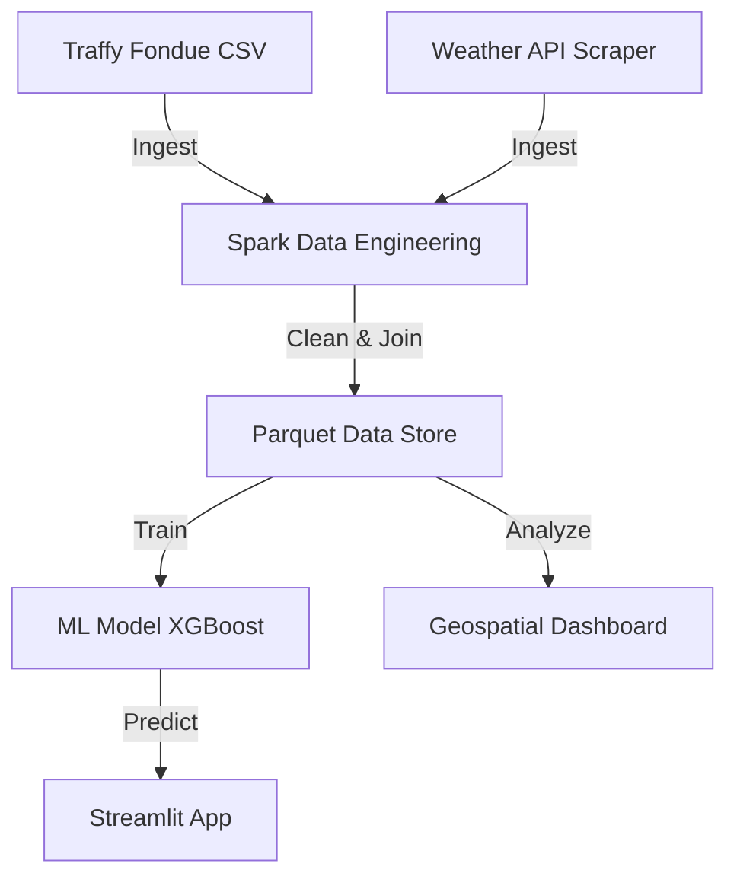

# Comprehensive Product Requirements Document (PRD)
## Traffy Fondue Resolution Time Prediction System

**Version:** 1.0
**Date:** 2025-12-07
**Status:** Approved for Implementation

---

## 1. Executive Summary

### 1.1 Product Vision
To empower the Bangkok Metropolitan Administration (BMA) and its citizens with a data-driven **Resolution Time Prediction System**. This system leverages historical complaint data and external factors (weather) to predict resolution timelines, visualize performance bottlenecks, and optimize resource allocation.

### 1.2 Business Problem
- **Citizen Uncertainty:** Citizens submitting complaints often have no visibility into when their issues will be resolved.
- **Operational Blind Spots:** Government officials lack granular data on which districts or departments are underperforming in specific complaint categories.
- **Resource Inefficiency:** Without predictive insights, resources cannot be proactively allocated to areas with high expected delays (e.g., during flood seasons).

### 1.3 Solution Overview
An end-to-end data science pipeline that:
1.  **Predicts** resolution time (in days) for incoming complaints using Machine Learning (XGBoost/Random Forest).
2.  **Correlates** external factors like weather (rainfall, temperature) with complaint volumes and resolution speeds.
3.  **Visualizes** district-level performance through interactive geospatial maps and dashboards.

---

## 2. Success Metrics & Goals

| ID | Metric | Target | Priority |
|----|--------|--------|----------|
| **M1** | **Model Accuracy (MAE)** | < 30 Days | High |
| **M2** | **Model Fit (R²)** | > 0.3 | Medium |
| **M3** | **Data Volume (Primary)** | Use all ~787,000 Traffy records | Critical |
| **M4** | **Data Volume (External)** | > 1,000 Weather records | Critical |
| **M5** | **System Latency** | Prediction < 2s on Demo App | Low |
| **M6** | **Usability** | Interactive Map with District Filtering | High |

---

## 3. System Architecture

### 3.1 High-Level Data Flow

### 3.2 Pipeline Components

#### Layer 1: Data Collection
*   **Source A:** Traffy Fondue Dataset (`bangkok_traffy.csv`)
    *   **Volume:** ~787,026 records (Aug 2021 - Jan 2025).
    *   **Key Fields:** `timestamp`, `coords`, `district`, `category` (type), `state`, `last_activity`.
*   **Source B:** External Weather Data (Open-Meteo / OpenWeatherMap)
    *   **Volume:** > 1,200 daily records covering the same period.
    *   **Fields:** `date`, `rainfall_mm`, `temperature_max`, `temperature_min`.

#### Layer 2: Data Engineering (Apache Spark)
*   **Ingestion:** Read CSVs into Spark DataFrames.
*   **Cleaning:** Handle nulls, parse Thai dates, standardizing district names.
*   **Feature Engineering:**
    *   *Temporal:* `hour`, `day_of_week`, `month`, `is_weekend`.
    *   *Geospatial:* Coordinate binning / District mapping.
    *   *Text:* `comment_length`, `num_categories`.
    *   *Target:* `resolution_time_days = (last_activity - timestamp).days`.
*   **Integration:** Join Complaint Data with Weather Data on `date`.
*   **Storage:** Export final training set to **Parquet**.

#### Layer 3: Machine Learning
*   **Task:** Regression (Supervised Learning).
*   **Model:** XGBoost Regressor (Primary), Random Forest (Baseline).
*   **Input Features:** `district`, `category`, `rainfall_mm`, `month`, `hour`.
*   **Target:** `resolution_time_days`.
*   **Output:** Predicted number of days to resolve.

#### Layer 4: Visualization & Application
*   **Geospatial Map (Folium):** Choropleth map showing average resolution time per district.
*   **Dashboard (Plotly):** Bar charts for Category performance and Monthly trends.
*   **Demo App (Streamlit):** Simple UI for users to input complaint details and get a prediction.

---

## 4. Functional Requirements

### 4.1 Data Engineering
*   **FR-DE-01:** System must ingest the raw CSV file using PySpark.
*   **FR-DE-02:** System must scrape at least 1,000 days of historical weather data.
*   **FR-DE-03:** System must join weather data with complaint data based on the date of the complaint.
*   **FR-DE-04:** System must export the cleaned, feature-rich dataset to Parquet format.

### 4.2 Machine Learning
*   **FR-ML-01:** System must train a regression model to predict `resolution_time_days`.
*   **FR-ML-02:** System must provide evaluation metrics: MAE, RMSE, and R².
*   **FR-ML-03:** System must generate a Feature Importance report (e.g., Does rain affect road repair time?).

### 4.3 Visualization
*   **FR-VI-01:** System must generate an HTML map (`resolution_map.html`) where districts are colored by average resolution time (Red=Slow, Green=Fast).
*   **FR-VI-02:** System must provide a dashboard showing the top 10 slowest complaint categories.

### 4.4 User Interface (Streamlit)
*   **FR-UI-01:** User can select a District and Category from a dropdown.
*   **FR-UI-02:** User can optionally input weather conditions (or assume average).
*   **FR-UI-03:** App displays the "Estimated Days to Complete".

---

## 5. Data Dictionary & Schema

### 5.1 Key Entities

**Table: Complaints (Processed)**
| Column Name | Data Type | Description |
|-------------|-----------|-------------|
| `complaint_id` | String | Unique ID |
| `timestamp` | Timestamp | Date filed |
| `district` | String | Bangkok district name (Thai) |
| `category` | String | Primary category (e.g., ถนน, ทางเท้า) |
| `resolution_time_days` | Float | **TARGET VARIABLE** |
| `rainfall_mm` | Float | Precipitation on filing date |
| `is_weekend` | Integer | 1 if Sat/Sun, else 0 |
| `comment_length` | Integer | Length of complaint description |

---

## 6. Project Roadmap

### Phase 1: Data Prep & Engineering (Week 1)
*   Setup Environment (Spark, Venv).
*   Develop Weather Scraper.
*   Build Spark Pipeline (Ingest -> Clean -> Join -> Parquet).

### Phase 2: Modeling (Week 2)
*   Train Baseline Model (Random Forest).
*   Train Advanced Model (XGBoost).
*   Tune Hyperparameters.
*   Analyze Feature Importance.

### Phase 3: Visualization & App (Week 3)
*   Build Geospatial Map.
*   Develop Streamlit Interface.
*   Integrate Model with App.

### Phase 4: Final Polish (Week 4)
*   Documentation.
*   Demo Video.
*   Final Presentation.

---

## 7. Technical Constraints
*   **Compute:** Must run on local machine (or Colab if needed for training).
*   **Storage:** Local filesystem (Parquet).
*   **Language:** Python 3.10+.
*   **Libraries:** `pyspark`, `xgboost`, `streamlit`, `folium`, `pandas`, `scikit-learn`.
